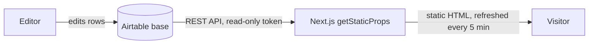

# Facility Management Software Comparison – Airtable as Headless CMS

A German-language comparison website for facility management software, built with **Next.js** and powered entirely by **Airtable as a headless CMS**.

Every piece of content on the page (hero text, software listings, ratings, pros and cons, prices, FAQs, SEO title and description) is edited in Airtable. Editors publish, unpublish and reorder entries there, and the live site picks up the changes automatically. No developer or redeploy is needed for content updates.

## How it works



1. **Content lives in Airtable.** One table per page section (see [Content model](#content-model)).
2. **Static generation.** At build time, `getStaticProps` loads all six tables in parallel through the Airtable REST API ([`lib/airtable.js`](lib/airtable.js)).
3. **Automatic refresh.** Incremental Static Regeneration (`revalidate: 300`) rebuilds the page in the background at most every 5 minutes. Visitors always get fast static HTML, and content changes go live without a redeploy.
4. **Safe defaults.** Every field has a fallback, so an empty cell in Airtable never breaks the page.

## Editorial workflow

| Task | What the editor does in Airtable |
|---|---|
| Publish a software listing | Set `Status` to `Live` |
| Hide a listing | Change `Status` to anything other than `Live` |
| Reorder listings or FAQs | Change `Ranking_Position` (lowest number appears first) |
| Reorder the "types" accordion | Change `Sort_Order`; tick `Default_Open` for the section that starts expanded |
| Edit page or SEO texts | Edit the `Homepage_Main` row in `Page_Content` |
| Add list items (features, pros, cons, bullets) | One item per line in the long-text field |

## Content model

| Table | Purpose | Key fields |
|---|---|---|
| `Page_Content` | Hero section and SEO, one row per page (`Page_ID`) | `Hero_Headline`, `Hero_Description`, `Hero_Button_Text`, `Logo_Website_URL`, `SEO_Title`, `SEO_Description` |
| `Listing_Intro` | Intro above the comparison | `Header_Intro`, `Pre_Header_Intro`, `Text_Intro` |
| `Listings` | The compared software products | `Name`, `Status`, `Ranking_Position`, `Badge_Text`, `Logo_CDN_URL`, `Rating_Score`, `Rating_Source_1..3_*`, `Pricing_Label`, `Features_List`, `Pros_List`, `Cons_List`, `CTA_Url`, `Video_Embed_URL` |
| `Types_Intro` | Intro for the "types of facility management" section | `Header_Types_Intro`, `Text_Types_Intro` |
| `Types` | Accordion entries | `Title`, `Description`, `Bullet_Points`, `Sort_Order`, `Default_Open` |
| `FAQs` | Frequently asked questions | `Question`, `Answer` (rich text), `Ranking_Position` |

Each listing card has four tabs, all filled from the same `Listings` row: *Überblick* (overview), *Merkmale* (features), *Vorteile/Nachteile* (pros and cons) and *Preisgestaltung* (pricing).

## Tech stack

- **Next.js 14** (Pages Router) with static generation and ISR
- **Airtable REST API** as the content backend
- **Tailwind CSS** for styling, **lucide-react** for icons

## Run locally

Requires Node.js 18+ and an Airtable base with the tables above.

```bash
git clone https://github.com/lequangninh/facility-management.git
cd facility-management
npm install
```

Create `.env.local` in the project root:

```bash
AIRTABLE_TOKEN=your_personal_access_token   # scope: data.records:read only
AIRTABLE_BASE_ID=appXXXXXXXXXXXXXX
```

```bash
npm run dev     # http://localhost:3000
npm run build && npm start   # production build
```

The token only needs **read** access to this one base. Keep it in `.env.local` (git-ignored) or in your hosting provider's environment settings, never in the code.

## Project structure

```
lib/airtable.js    Airtable client: one function per table, field mapping and fallbacks
pages/index.js     the page: data loading (getStaticProps) and all sections
pages/_app.js      global styles
styles/            Tailwind CSS
```
